# Site Finance — a multi-site spend & budget teardown

A **site finance / FP&A** analysis that treats **every location as its own financial
unit** — plants, offices and distribution centers alike. Where does each **site's**
money go, which sites **beat or bust budget**, what does a site really cost once
corporate overhead is loaded onto it, and which sites are genuinely efficient.

> The unit of analysis is the **site**, not the production line. Plants are one *type*
> of site here; offices and DCs are first-class alongside them. This is the seat a
> **site finance business analyst** sits in — supporting site managers and rolling the
> portfolio up for leadership — not a single-plant cost-accounting deep dive.

The company is fictional, but its costs are **anchored to real U.S. Census data**, so
the numbers behave like a real portfolio.

> **Data honesty.** This is a *hybrid* dataset, and the seam is labeled on purpose:
> - **Real (downloaded, reproducible):** establishment counts and labor cost per
>   employee for every manufacturing subsector, from **Census County Business
>   Patterns 2022**; macro cost structure from **ASM 2021** ($6.1T shipments) and
>   **ACES 2022** ($314.3B capex); and real **commodity prices (FRED PPI)** for
>   steel, plastic resin, semiconductors, electrical parts and diesel that drive the
>   procurement module. See [`scripts/01_build_anchors.py`](scripts/01_build_anchors.py)
>   and [`scripts/04_fetch_ppi.py`](scripts/04_fetch_ppi.py).
> - **Synthetic (generated, seeded):** the specific company "Meridian Precision
>   Manufacturing," its 11 sites, and 36 months of actual-vs-budget cost lines. Each
>   plant is tied to a real NAICS subsector and pays its **real** per-employee labor
>   rate; the movements and the problems to find are invented. See
>   [`scripts/02_generate_company.py`](scripts/02_generate_company.py).
>
> Nothing real is fabricated; nothing synthetic is dressed up as real.

This is project #3 in an IE/operations portfolio, extending the story from **line
efficiency (MES)** → **energy (BDG2)** → **the financial layer**: the same sites,
now read through the general ledger.

---

## The business question

A site finance analyst has one recurring job: **make each site accountable for its
money.** Every month the portfolio spends ~$37M; the review deck has to answer

1. What does each **site** cost — direct, and **fully-loaded** with its share of corporate?
2. Which sites are over or under **budget**, and on which **drivers**?
3. Which sites are genuinely **efficient** ($/head, $/sqft) once you compare like with like?
4. Own vs **lease**, corporate **allocation**, cost **trends** — act now or leave alone?

The dataset and dashboards are built to answer exactly those.

---

## Site-finance view — every location as a financial unit

**The portfolio: 11 sites, ~$446M/yr, +1.8% over budget.** But the point of site finance
is that the site — not the company average — is the unit that gets managed.

**1. A site's cost structure is a fingerprint of its type.**
Offices are ~all labor + facilities; plants are labor + materials; DCs are labor +
logistics. The mini-P&L below is how a site analyst reads a location at a glance and
knows which levers even exist there.

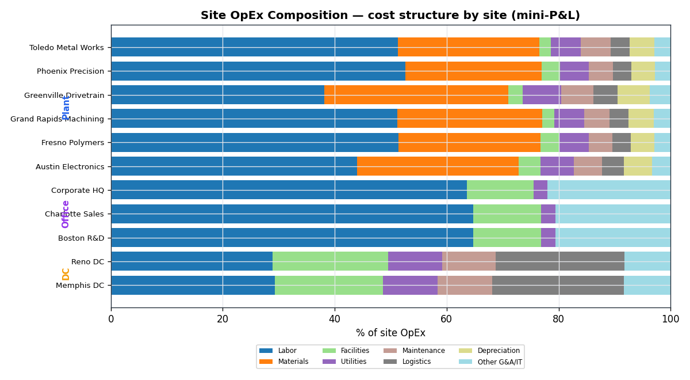

**2. Fully-loaded cost is the number that actually matters.**
Corporate HQ is **$34.6M/yr** of overhead that no operating site sees on its own P&L.
Allocated by cost share, it adds **$10k–$20k per head** on top of direct cost — and
**Austin ends up the most expensive site at $257k/head fully loaded**. Site managers
argue about direct cost; finance owns the loaded view.

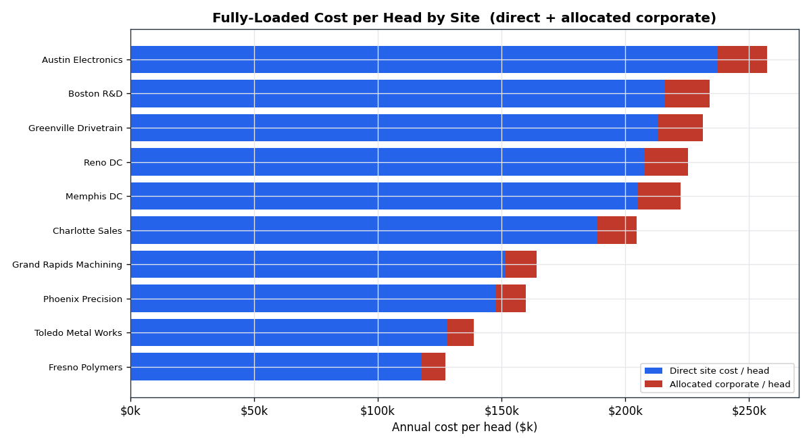

**3. Owned sites look almost free on cash — until you count capital.**
Owned facilities run **~$7/sqft** vs **~$41/sqft leased (5.6×)**, because owned sites
carry no rent, only upkeep. That's the real lease-vs-own cash story a site portfolio
review has to frame honestly (the owned sites still tie up capital and depreciation).

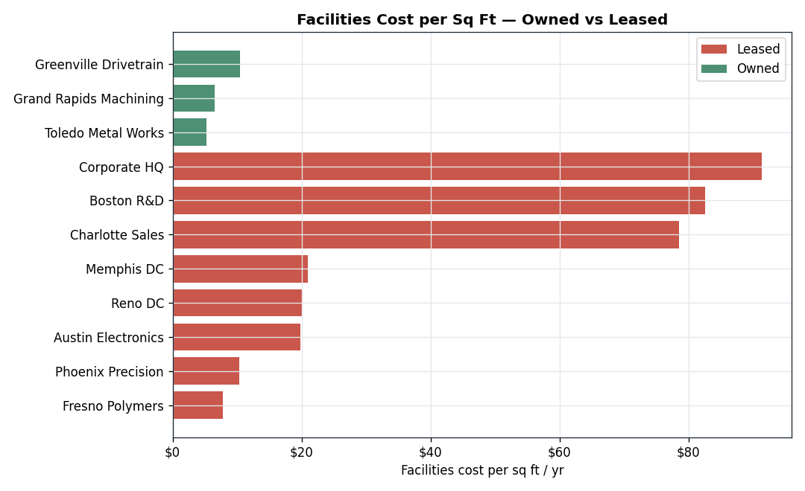

---

## Cost & budget-variance detail — Meridian Precision Manufacturing (FY2022–2024)

**Portfolio: $1,337.8M actual vs $1,313.7M budget → +1.8% ($+24.1M over).**
A calm-looking 1.8% at the top hides very different stories underneath.

**1. The overspend is a materials-inflation story, not a discipline story.**
Of the cost categories, **Raw Materials drove +$15.8M** of unfavorable variance,
Utilities +$3.2M, Maintenance +$1.9M — while overhead ran on plan. Input-cost
inflation, not loose spending, is the headline.

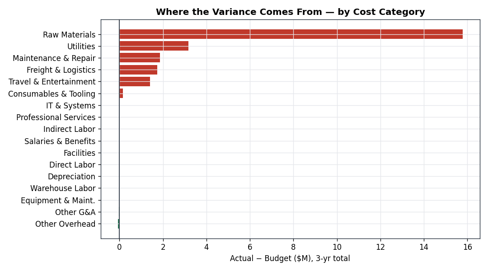

**2. One plant's maintenance is quietly compounding.**
Toledo Metal Works (owned, opened 2004) runs its Maintenance & Repair variance
**+$213k → +$489k → +$945k** across 2022→2024 — a classic aging-asset signature that
a % -of-total view hides. This is a capital-vs-repair decision waiting to be made.

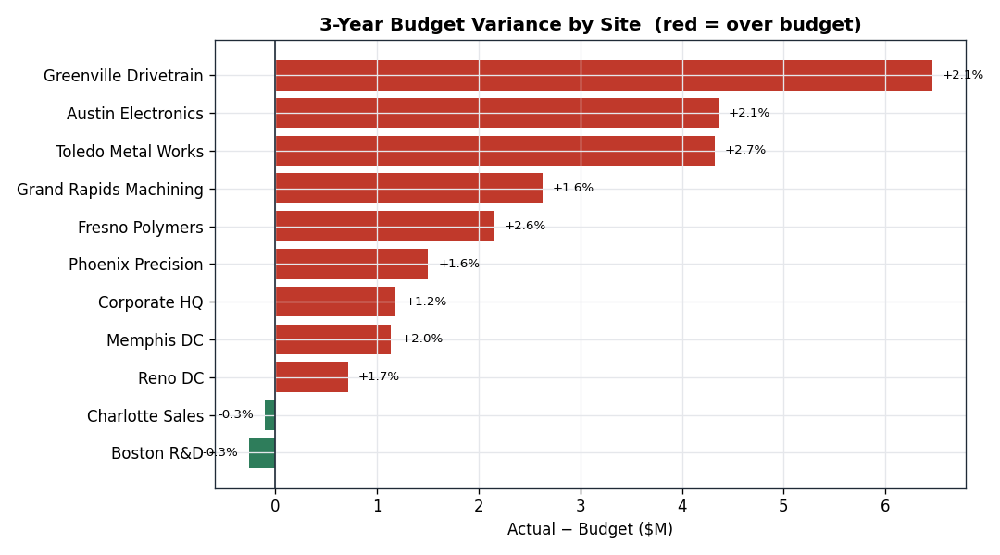

**3. "Cost per head" lies unless you normalize for product mix.**
Raw annual cost/head runs from **$117k (Fresno)** to **$237k (Austin)** — but Austin
builds electronics (NAICS 334, a real ~$100k/employee payroll subsector) while Fresno
molds plastics (NAICS 326). The efficiency ranking only becomes fair after you anchor
each plant to its subsector — which is exactly why the real Census labor rates matter.

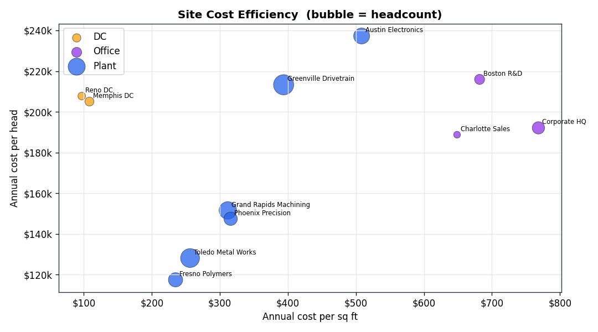

**4. Unit economics move the right way where volume ramps.**
Austin's cost per unit improves as production scales, even against materials inflation
— the scale-economy signal survives. Grand Rapids, with softening volume, drifts the
other way.

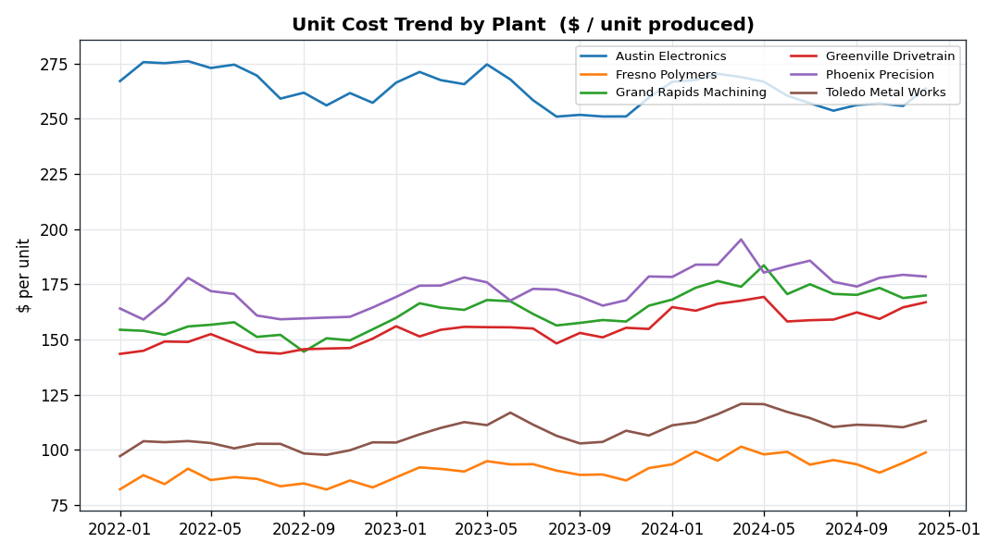

**5. Two clean wins worth copying.**
HQ **Travel & Entertainment** blew through budget by **+$1.1M in 2024** (return-to-
travel) — a policy lever. And the **Memphis DC lease renegotiation cut facilities cost
−11%** mid-2023 — proof the portfolio *can* bend cost when someone acts.

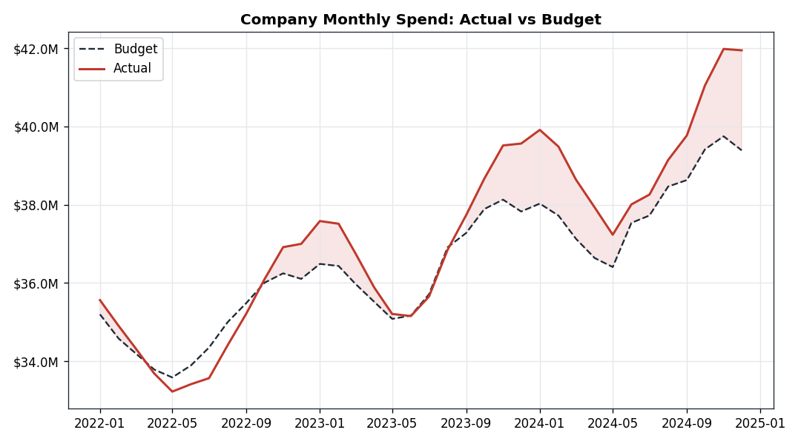

---

## Bonus lens — procurement & supplier spend

A second, more procurement-flavored cut for range (it leans toward central
procurement / plant cost, so it sits after the site view, not ahead of it). **Managed
spend of $357.2M** flows through 16 suppliers, and the direct-material portion
**reconciles to the penny with the Raw Materials cost line** above ($256.3M) — the
modules are one company, not two spreadsheets. Prices are driven by **real FRED
commodity indexes**.

**6. Spend is Pareto-concentrated — manage the vital few.**
**9 of 16 suppliers = 80% of spend**; Great Lakes Steel alone is $63.4M. That's where
category strategy and QBRs should go; the long tail is a consolidation target.

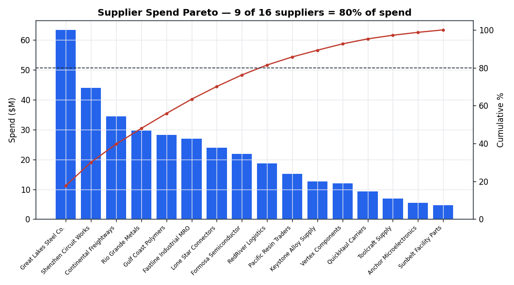

**7. Purchase Price Variance splits exactly along the real commodity cycle.**
Net PPV is **−$19.7M favorable**, but it's two stories: **steel −$12.5M, freight
−$6.3M, plastic −$4.7M favorable** (those PPIs fell from their 2022 peaks), while
**electrical/electronic +$2.2M and MRO +$2.2M ran unfavorable** (electrical PPI rose
+16%). That unfavorable electronics line is the same pressure showing up as Austin's
material cost on the finance side — one root cause, two reports.

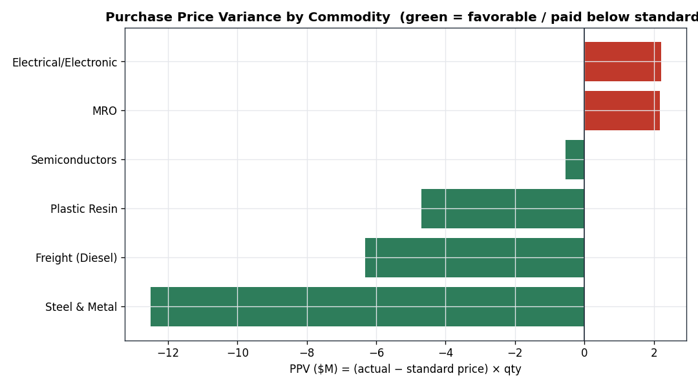

**8. Single-source risk is concentrated in semiconductors.**
Semiconductors carry an **HHI of 6,800** (anything >2,500 is "highly concentrated"):
**Formosa Semiconductor is single-source on $21.8M**. Favorable price today doesn't
offset a supply-continuity risk on the highest-value input — a dual-source
recommendation writes itself.

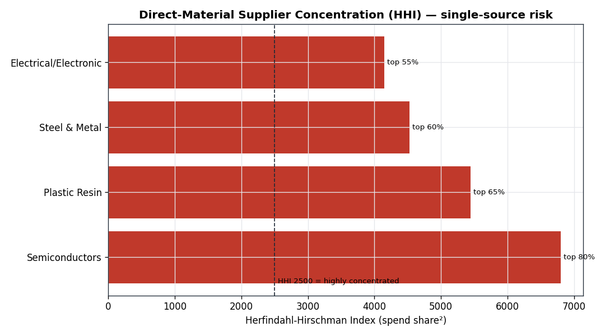

**9. $45.6M (13%) is maverick spend, bought ~6% over contract.**
Off-contract buying — mostly tail MRO — pays a measurable price penalty vs the
on-contract rate. Routing it onto existing agreements is a clean, self-funding savings
play, on top of the **$11.3M already realized** vs prior-year baseline.

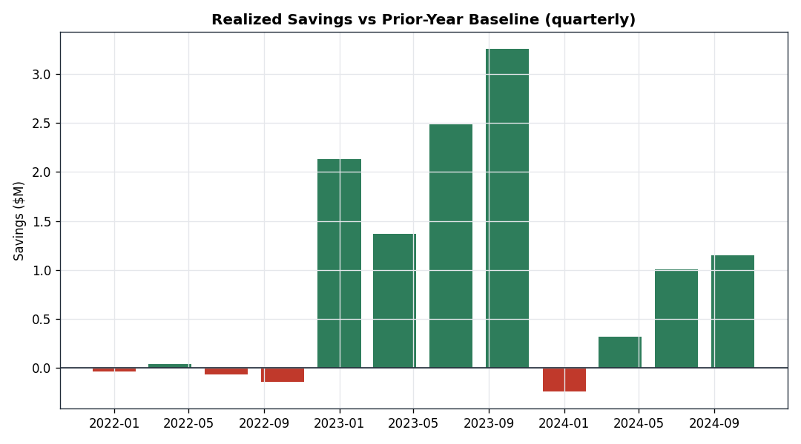

---

## Why this matters (IE / Finance reading)

- **The site is the accountable unit.** Leadership doesn't manage a company average;
  it manages locations. Fully-loaded cost per site — direct **plus** allocated
  corporate — is the number a site finance analyst defends, and it changes the ranking.
- **Variance analysis is triage, not accounting.** The point isn't the $24.1M number;
  it's separating the *controllable* (T&E policy, a lease, a maintenance-vs-capital
  call) from the *market* (materials inflation you hedge, not scold).
- **Benchmarks need the right denominator.** $/head and $/sqft only compare sites
  fairly after normalizing for subsector — the reason this project spends effort on
  real Census labor anchors instead of a flat assumption.
- **Trends beat snapshots.** Toledo maintenance and HQ travel are invisible in a
  single month and obvious across 36. The dashboard is built time-first.

---

## Repo layout

```
ie-plant-finance-analysis/
├── scripts/
│   ├── 01_build_anchors.py         # REAL Census anchors -> anchor_labor/cost CSVs
│   ├── 02_generate_company.py      # synthetic company grounded in the anchors
│   ├── 03_analysis.py              # cost / budget-variance views + figures
│   ├── 07_site_finance.py          # SITE view: OpEx mix, corp allocation, own/lease
│   ├── 04_fetch_ppi.py             # REAL FRED commodity PPI -> anchor_ppi.csv
│   ├── 05_generate_procurement.py  # supplier spend, reconciled to Raw Materials
│   └── 06_procurement_analysis.py  # PPV, savings, concentration, maverick + figures
├── data/
│   ├── raw/                    # cbp22st.txt (89 MB, gitignored, re-downloadable)
│   └── processed/              # anchors + dim_site/supplier, fact_* + site_pnl
├── figures/                    # 12 analysis charts (PNG)
├── TABLEAU_GUIDE.md            # build the interactive dashboard from the CSVs
└── docs/DATA_DICTIONARY.md     # every column, and which are real vs synthetic
```

## Reproduce

```bash
pip install -r requirements.txt

# 1. real anchor (downloads the keyless Census CBP flat file, ~12 MB zip)
curl -L -o data/raw/cbp22st.zip \
  https://www2.census.gov/programs-surveys/cbp/datasets/2022/cbp22st.zip
unzip -o data/raw/cbp22st.zip -d data/raw/
python scripts/01_build_anchors.py

# 2. generate the company (seeded -> identical every run)
python scripts/02_generate_company.py

# 3. cost / budget-variance + site-finance views (allocation, own/lease)
python scripts/03_analysis.py
python scripts/07_site_finance.py

# 4. bonus: procurement module — real commodity PPI -> supplier spend -> analysis
python scripts/04_fetch_ppi.py            # downloads real FRED PPI (keyless)
python scripts/05_generate_procurement.py # reconciles to Raw Materials
python scripts/06_procurement_analysis.py
```

## Tableau
`fact_site_costs.csv` is a tidy long table built for Tableau — see
[`TABLEAU_GUIDE.md`](TABLEAU_GUIDE.md) for the sheet-by-sheet build (KPI row, variance
waterfall, unit-cost trend, efficiency scatter, and a site/category filter).
